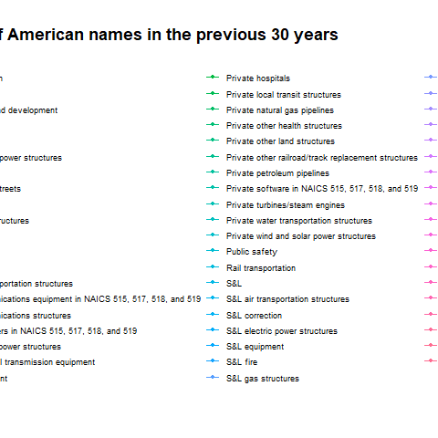

# BEA Infrastructure Investment
**TidyTuesday Project**

------

>  - 📱 Linkedin [Juan Antonio Cabeza Sousa
](https://www.linkedin.com/in/juan-antonio-cabeza-sousa-5b954968/)
>  - 📬 Email:  juaancabsou@gmail.com
>  - 🖥️ Twitter: @[Aceconhielo](https://twitter.com/Aceconhielo)


This notebook is about *Measuring Infrastructure in the Bureau of Economic Analytics National Economic Accounts*.

# Introduction
Infrastructure provides critical support for economic activity. Hence it contributes in a significant way to our living standards. This notebook will analyze the trends of infrastructure investment through the years (decades) using the measurements of infrastructure data in the U.S. National Economic Accounts(NEAs).

For this notebook, I will use the `chain_investment.csv` dataset. I think that using the chained dollars(*) will give us better insights about how much important was the investment in that year(decade) comparing it with nowadays infraestructure investements. 

* *Chained dollars: Chained dollars is a method of adjusting real dollar amounts for inflation over time, to allow the comparison of figures from different years. The U.S. Department of Commerce introduced the chained-dollar measure in 1996*.

**Why is it important?**

This study is a challenge that will provide a huge value understanding the nature of the surrounding infrastructure and its behavior a connected multi-network.


```{r Libraries, echo=FALSE, message=FALSE}
library(tidyverse)
library(gganimate)
library(hrbrthemes)
library(ggplot2)
library(ggpubr)


```


```{r Download the data, message=FALSE, include=FALSE}
tuesdata <- tidytuesdayR::tt_load('2021-08-10')
tuesdata <- tidytuesdayR::tt_load(2021, week = 33)
```


```{r Create datasets, echo=FALSE, message=FALSE}
investment <- tuesdata$investment
chinvestment <- tuesdata$chain_investment
ipd <- tuesdata$ipd

head(chinvestment)
```

# A glance to the data
Following the [Bureau of Economic Analysis paper](https://www.bea.gov/system/files/papers/BEA-WP2020-12.pdf), **there are three main categories of infrastructure: basic, social and digital**. 

* **Basic infrastructure**: Mainly determined by trends in transportation and power. Water, sewer, and conservation and development (dams, levees, sea walls, and related assets) make up a relatively small share of basic infrastructure.

* **Social infrastructure**: Determined by trends in health, education, and public safety. For social infrastructure, the share of privately owned net stock grew over time while the share of state.

* **Digital infrastructure**: Communications, software...etc.

That being said, let's start working with those three main categories from the `chain_investment.csv`. 

```{r Data Wrangling}
df_main_cat = chinvestment %>%
  filter(group_num == 1)

head(df_main_cat)

```


```{r message=FALSE, include=FALSE, results=FALSE}
# Plot
chart_ti <- df_main_cat %>%
  ggplot(aes(x=year, y=gross_inv_chain, fill=category)) +
  geom_area()+
  ggtitle("Basic Infrastructures Investments ($)") +
  theme_ipsum() +
  ylab("$") +
  theme(legend.position="top")+
  transition_reveal(year)


anim_save("chart_ti.gif", chart_ti)
# 


```

# 

```{r}
data("ToothGrowth")
head(ToothGrowth)


# Box plot (bp)
bxp <- ggboxplot(ToothGrowth, x = "dose", y = "len",
                 color = "dose", palette = "jco")
bxp
# Dot plot (dp)
dp <- ggdotplot(ToothGrowth, x = "dose", y = "len",
                 color = "dose", palette = "jco", binwidth = 1)
```


```{r}
ggarrange(bxp, dp, labels = c("A", "B"),
          ncol = 2, nrow = 1)
```

