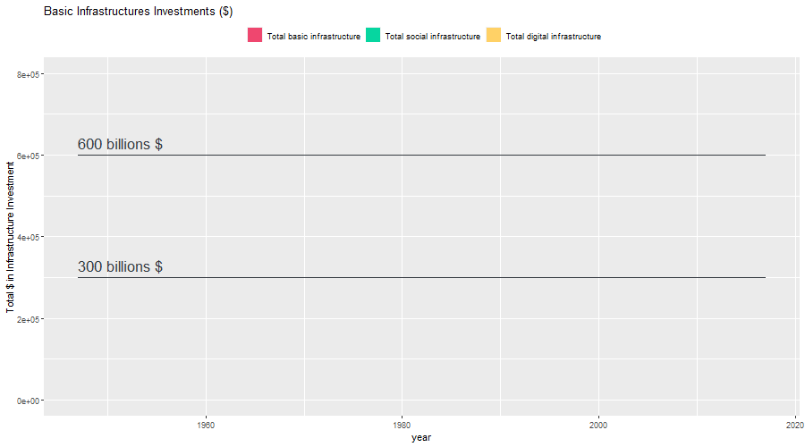

**TidyTuesday Project**

------

>  - 📱 Linkedin [Juan Antonio Cabeza Sousa
](https://www.linkedin.com/in/juan-antonio-cabeza-sousa-5b954968/)
>  - 📬 Email:  juaancabsou@gmail.com
>  - 🖥️ Twitter: @[Aceconhielo](https://twitter.com/Aceconhielo)


This notebook is about *Measuring Infrastructure in the Bureau of Economic Analytics National Economic Accounts*.

# Introduction
Infrastructure provides critical support for economic activity. Hence it contributes in a significant way to our living standards. This notebook will analyze the trends of infrastructure investment through the years (decades) using the measurements of infrastructure data in the U.S. National Economic Accounts(NEAs).

For this notebook, I will use the `chain_investment.csv` dataset. I think that using the chained dollars(*) will give us better insights about how much important was the investment in that year(decade) comparing it with nowadays infraestructure investements. 

* *Chained dollars: Chained dollars is a method of adjusting real dollar amounts for inflation over time, to allow the comparison of figures from different years. The U.S. Department of Commerce introduced the chained-dollar measure in 1996*.

**Why is it important?**

This study is a challenge that will provide a huge value understanding the nature of the surrounding infrastructure and its behavior a connected multi-network.


```{r Libraries, echo=FALSE, message=FALSE}
library(tidyverse, warn.conflicts = FALSE)
library(gganimate)
library(hrbrthemes)
library(ggplot2)
library(ggpubr)
library(plotly)
fontfamily <-"Open Sans"

```


```{r Download the data, message=FALSE, include=FALSE}
tuesdata <- tidytuesdayR::tt_load('2021-08-10')
tuesdata <- tidytuesdayR::tt_load(2021, week = 33)

chinvestment <- tuesdata$chain_investment

```


# A glance to the data
Following the [Bureau of Economic Analysis paper](https://www.bea.gov/system/files/papers/BEA-WP2020-12.pdf), **there are three main categories of infrastructure: basic, social and digital**. 

* **Basic infrastructure**: Mainly determined by trends in transportation and power. Water, sewer, and conservation and development (dams, levees, sea walls, and related assets) make up a relatively small share of basic infrastructure.

* **Social infrastructure**: Determined by trends in health, education, and public safety. For social infrastructure, the share of privately owned net stock grew over time while the share of state.

* **Digital infrastructure**: Communications, software...etc.
```{r Glancing the data, echo=FALSE}
head(chinvestment)

```

That being said, let's start working with those three main categories from the `chain_investment.csv`. 

```{r MainCat - Data Wrangling I }
df_main_cat = chinvestment %>%
  filter(group_num == 1) %>%
  mutate(
    label = case_when(
      category == "Total basic infrastructure"~"Basic",
      category == "Total digital infrastructure"~"Digital",
      category == "Total social infrastructure"~"Social"
    ),
      colorL = case_when(
      category == "Total basic infrastructure"~"#ef476f",
      category == "Total digital infrastructure"~"#ffd166",
      category == "Total social infrastructure"~"#06d6a0"
    )
  )


```


```{r MainCat - Data Plot I, message=FALSE, include=FALSE, results=FALSE, fig.width = 12, fig.height = 5}
# Plot
chart_ti <- df_main_cat %>%
  ggplot(aes(x=year, y=gross_inv_chain, fill=category)) +
  geom_area()+
  ggtitle("Basic Infrastructures Investments ($)") +
  scale_fill_manual(breaks=df_main_cat$category,values=df_main_cat$colorL)+
  scale_color_manual(breaks=df_main_cat$category,values=df_main_cat$colorL)+
  ylab("Total $ in Infrastructure Investment") +
  theme(legend.position="top", legend.title=element_blank())+
  annotate(geom = "segment", x=1947,xend=2017, y=600000,yend=600000, color="#343a40")+
  annotate(geom = "segment", x=1947,xend=2017, y=300000,yend=300000, color="#343a40")+
  annotate(geom = "text", x=1947, y=630000, label="600 billions $", color="#343a40",
            hjust=0, size=6,family=fontfamily)+
  annotate(geom = "text", x=1947, y=330000, label="300 billions $", color="#343a40",
            hjust=0, size=6,family=fontfamily)+
  transition_reveal(year)


anim_save("chart_ti.gif", chart_ti)

```


```{r message=TRUE, warning=FALSE, fig.width = 12, fig.height = 5}
chart_lines <- df_main_cat %>%
  ggplot(aes(x=year, y=gross_inv_chain)) +
  geom_line(aes(color=category))+
  geom_point(aes(color=category))+
  guides(fill=FALSE, color=FALSE)+
  theme_minimal()+
  scale_color_manual(breaks=df_main_cat$category,values=df_main_cat$colorL)+
  ylab("Total $ in Infrastructure Investment") +
  theme(legend.position="none", legend.title=element_blank())


chart_area <- df_main_cat %>%
  ggplot(aes(x=year, y=gross_inv_chain, fill=category)) +
  geom_area()+
  scale_fill_manual(breaks=df_main_cat$category,values=df_main_cat$colorL)+
  scale_color_manual(breaks=df_main_cat$category,values=df_main_cat$colorL)+
  ylab("Infrastructure Investment ($) per category") +
  guides(fill=FALSE, color=FALSE)+
  theme_minimal()+
  theme(legend.position="none", legend.title=element_blank())+
  annotate(geom = "segment", x=1947,xend=2017, y=600000,yend=600000, color="#343a40")+
  annotate(geom = "segment", x=1947,xend=2017, y=300000,yend=300000, color="#343a40")+
  annotate(geom = "text", x=1947, y=630000, label="600 billions $", color="#343a40",
            hjust=0, size=6,family=fontfamily)+
  annotate(geom = "text", x=1947, y=330000, label="300 billions $", color="#343a40",
            hjust=0, size=6,family=fontfamily)
  
  
```
# 

```{r message=TRUE, warning=FALSE, fig.width = 12, fig.height = 5}
ggarrange(chart_area, chart_lines, ncol = 2, heights = c(10, 10), align = "v")
```


# Infrastructure Investment Breakdown (sankey)

We already know how the money is invested in the three main categories (basic, social and digital) so let's break it down in order to see how much money is invested in each subcategory. 

In order to do that, Sankey (*) charts are a viable option.

Following the Google Charts definition, *a sankey diagram is a visualization used to depict a flow from one set of values to another. The things being connected are called nodes and the connections are called links. Sankeys are best used when you want to show a many-to-many mapping between two domains.*

Split the dataset in different levels will be necessary for generating the Sankey chart (spoiler alert: There are three different levels regarding the investments). In order to do that:

* **Level 1:** We will start analyzing from the `meta_cat` to the `category` when category is one of the three main categories: Basic, Social or Digital. That's because `Total infrastructure` will be our root node.

* **From Level 2 to Level 3:** We will use `meta_cat` using the categories from the previous level in order to get the new nodes and so on so forth.

```{r InvBreakdown - Data Wrangling I, message=FALSE, warning=FALSE}
options(dplyr.summarise.inform = FALSE)

# Remember: We need to remove the fund sources
dfch_grp <- chinvestment %>% 
  group_by(category, meta_cat, group_num) %>%
  filter(!(category %in% c("Federal", "S&L", "Private")) &(group_num!=14))   %>%
  summarise(inv = sum(gross_inv_chain))

dfch_grp <- dfch_grp %>%
      mutate(
        category = case_when(
        category == "Total basic infrastructure"~"Basic",
        category == "Total digital infrastructure"~"Digital",
        category == "Total social infrastructure"~"Social",
        TRUE ~category
        ), meta_cat =case_when(
          meta_cat == "Total basic infrastructure"~"Basic",
          TRUE ~meta_cat
        )
    )

# dfch_grp$category <- as.factor(dfch_grp$category)
# dfch_grp$meta_cat <- as.factor(dfch_grp$meta_cat)
# Level 1: Total infrastructure => Total basic/social/digital infrastructure
lvl1 <- dfch_grp %>% 
      filter(meta_cat %in% "Total infrastructure")


lvl2 <- dfch_grp %>% filter(meta_cat %in% c(
      "Basic",
      "Digital",
      "Social"
  ))


lvl3 <- dfch_grp %>% filter(meta_cat %in% lvl2$category)
labelsV <- c(unique(lvl1$meta_cat), unique(lvl2$meta_cat), unique(lvl2$category),unique(lvl3$category))

sourceV <-c(match(lvl1$meta_cat, labels), match(lvl2$meta_cat,labels), match(lvl3$meta_cat,labels))
targetV <- c(match(lvl1$category, labels), match(lvl2$category,labels), match(lvl3$category,labels))
valueV <- c(lvl1$inv, lvl2$inv, lvl3$inv)
             

# lvl1
# lvl2
# lvl3

```


```{r InvBreakdown - Plotting, echo=FALSE, fig.height=6, fig.width=8, warning=FALSE}

fig_sankey <- plot_ly(
    type = "sankey",
    orientation = "h",
  
    node = list(
      label = labelsV,
      # color = c("blue", "blue", "blue", "blue", "blue", "blue"),
      pad = 15,
      thickness = 20,
      line = list(
        color = "black",
        width = 0.5
      )
    ),
  link = list(
    source = sourceV-1,
    target = targetV-1,
    value = valueV
  )
)

fig_sankey <- fig_sankey %>% layout(
  title='USA Infraestructure Investment Breakdown ($)',
  font = list(size=10)
)

fig_sankey

```

